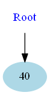

MIN-MAX HEAP
====================

This repository has a project with the implementation of a MIN-MAX HEAP.

It is written in C++.

The code of the MIN-MAX HEAP is independent of platform.

Is has two possible main files:

* [Codes](#markdown-header)
	* [A main that triggers unit test;](#markdown-header-emphasis)

	* [A Qt project to manage the MIN-MAX HEAP (With Gui).](#markdown-header-strikethrough)
	
The library used to make the Unit Test is the Catch v2.12.3. The code is already in this repository.

The Qt project generates images of the MIN-MAX HEAP, using the lib Graphviz.
Install this lib in your computer for you to be able to create such images.

The code was written containing the Doxygen documentation.

- - -

You have several options to build the project: 
====================

* [Build tools](#markdown-header)
	* [Makefile (using the file named MakefileGeneral);](#markdown-header-emphasis)
	* [CMake.](#markdown-header-emphasis)
	* [Qt Project (With QMake).](#markdown-header-emphasis)

The project has no leaks (Fully tested with Valgrind).

All the unit tests are ok.

- - -

The functionalities available are: 
====================

* [Functionalities](#markdown-header)
	* [Insert;](#markdown-header-emphasis)
	* [Remove minimum number;](#markdown-header-emphasis)
	* [Remove maximum number;](#markdown-header-emphasis)
	
- - -

Sample images: 
====================

## This is the sample without colors.

## This is the sample with colors. The blue color represents a min level. The red color represents a max level.

Insertion steps (without colors): 
====================

## Initial

## Inserting 40

## Inserting 50

## Inserting 75

## Inserting 35

## Inserting 20

## Inserting 60

## Inserting 4

## Inserting 2

Insertion steps (with colors): 
====================

## Initial

## Inserting 40

## Inserting 50

## Inserting 75

## Inserting 35

## Inserting 20

## Inserting 60

## Inserting 4

## Inserting 2

Remove min steps (without colors, for instance): 
====================

## Initial

## Removing min

## Removing min

## Removing min

## Removing min

## Removing min

## Removing min

## Removing min

## Removing min

Remove max steps (with colors, for instance): 
====================

## Initial

## Removing min

## Removing min

## Removing min

## Removing min

## Removing min

## Removing min

## Removing min

## Removing min

Qt gui project: 
====================
The qt gui application gui is shown below:

## This is the sample with colors. 

##  This is the sample without colors. The blue color represents a min level. The red color represents a max level.

